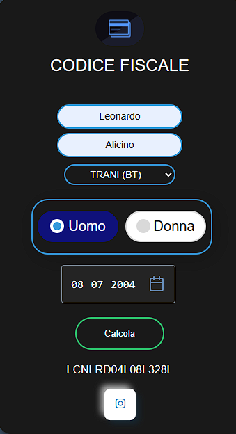

# 🆔 Calcolatore Codice Fiscale (Pure JS Logic)

Un'applicazione web interattiva che permette di generare il codice fiscale italiano a partire dai dati anagrafici dell'utente. Il progetto è focalizzato sulla manipolazione delle stringhe e sull'implementazione dell'algoritmo ufficiale di calcolo.

## 🛠️ Caratteristiche Tecniche
- **Sviluppo 100% Manuale**: Codice scritto interamente senza l'ausilio di AI, basato su logica condizionale e manipolazione del DOM.
- **Regex Mastery**: Utilizzo di espressioni regolari complesse per estrarre correttamente consonanti e vocali da nomi e cognomi (regola del 1°, 3° e 4° carattere).
- **Interfaccia Custom**: CSS personalizzato con effetti di hover, gestione dei radio button stilizzati e layout responsive.
- **Database Comuni**: Implementazione di un vasto elenco di codici catastali dei comuni italiani direttamente nel DOM.

## 📂 Struttura
- `index.html`: Struttura del form e database dei comuni.
- `style.css`: Design dark mode e animazioni.
- `script.js`: Motore di calcolo (estrazione caratteri, gestione mesi e calcolo carattere di controllo).

## ⚠️ Bug Noti & Limitazioni
- **Range Temporale**: Il selettore della data e la logica di calcolo presentano limitazioni per gli anni successivi al 2023. 
- **Database**: L'elenco dei comuni è statico e potrebbe non includere i comuni nati da fusioni recentissime.

## 🚀 Come testarlo
Basta scaricare la cartella e aprire il file `index.html` in qualsiasi browser moderno. Non serve un server locale.

## 📸 Anteprima del Progetto

| Home Page | 
| :---: | 
|  | 

---
**Sviluppato da leoalicino**